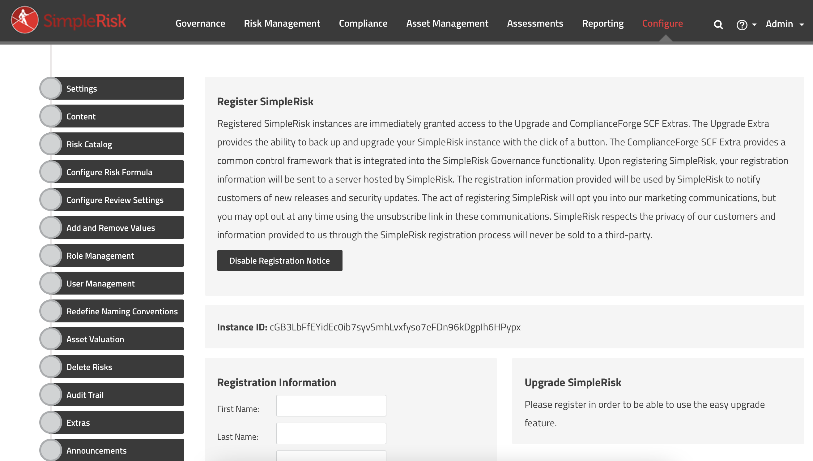

# Simplerisk
Simplerisk bir GRC uygulamasıdır. **G**overnance **R**isk **C**ompliance kelimelerinin ilk harflarinden oluşan bu kavram uçtan uca bir uyumluluk ve risk yönetimini ifade eder.

Bu açık kaynak uygulama ile gerek projenizin ve gerekse diğer tüm yönetilmesi gereken süreçlerinizin risklerini merkezi olarak yönetebilirsiniz. 
# Kurulum
Kendi makinemizde kendi projemizin risklerini yönetmek üzere bir kurulum anlatacağım. Bu nedenle kullanılan parola ve isimler basit olacak. Siz kendi ihtiyaçlarınıza göre düzenleyebilirsiniz.
## Database
Infrastructure klasöründe yer alan MySQL servisinin deploy edilmiş olduğunu ve çalışır durumda olduğunu kabul ederek başlıyoruz.

##Simplerisk
Öncelikle simplerisk için oluşturulan configmap içindeki **SIMPLERISK_DB_HOSTNAME** anahtarının doğru servisi gösterdiğinden emin olmalısınız. Eğer mysql örneğinizin servis adı farklı ise bu konuda değişiklik yapmalısınız. mysql56 yı uyumluluk gereksinimi nedeni ile kullandık. configmap içinde mysql admin parolasını vererek veritabanını kendisinin oluşturmasını sağladık. Aksi takdirde schema yı simplerisk den indirip kendimiz import etmemiz gerekiyor.

* Kendime Not: Uygun bir zamanda özel bir image oluşturmak gerek. 

Buyrun komutlar;
```console
SimpleRisk % kubectl apply -f 00-namespace
SimpleRisk % kubectl apply -f 01-Simplerisk
```
Kurulum sonunda veritabanımızda simplerisk diye bir veritabanı oluştu ve uyumlu schema yüklendi. Son bir işlem olarak configmap içinden;
```console
#FIRST_TIME_SETUP: "1"
```
satırını pasif hale getirip;
```console
kubectl apply -f 01-Simplerisk
```
komutunu vermemiz yeterli olacaktır.
## Servise Erişim
Peki bu servise nasıl erişeceğiz ? Hemen daha önce öğrendiklerimizi hatırlayalım. LoadBalancer tipinde bir servisimiz var burada da. tunnel açıp doğrudan external IP bilgisi ile erişebiliriz. Ya da;
```console
SimpleRisk % minikube service -n simplerisk simplerisk --url
http://192.168.99.101:30448
http://192.168.99.101:32567
````
komutu ile erişim url si üzerinden erişebiliriz. http ile bağlandığınız port https e yönlendirecektir. Sertifika hatasını gözardı edebilirsiniz. Unutmadan default admin hesabı admin:admin

Bu uygulamanın kullanımı ile ilgili detaylı bir çalışmayı yakında yayınlayacağım. Şimdilik herkesin kendi makinesinde çalışabilir duruma gelmesi inceleme açısından yararlı olacaktır.