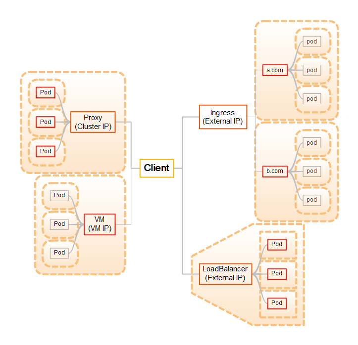

# Genel Bilgiler
Bu bölümde, klasör içinde verilmiş olan yapılandırmaları kullanırken kullanabileceğiniz faydalı birkaç bilgiyi bulacaksınız.
# Servis Tipleri
Servis tanımlarında LoadBalancer kullanımını, eğer servis sadece diğer servisler tarafından kullanılmayıp dışarıdan erişilecekse tercih edilmesi gereken bir durumdur. Eğer erişilen servis HTTP/HTTPS ise ve arkada bir grup servise erişilecekse ingress de değerlendirilebilir. Servisler arası erişimin yeterli olduğu durumda ClusterIP çoğu senaryo için uygun bir yöntem olarak çalışacaktır.

Aşağıdaki görselde muhtemel senrayolar için akış örnekleri verilmiştir;



Burada görüleceği üzere değişik tiplerde değişik davranışlar söz konusudur. Proxy kullandığımızda servise client ClusterIP den erişirken, LoadBalancer kullandığımızda External IP'den bağlanır. Benzer şekilde diğer servisler de resimde gösterildiği şekildedir. Yapının büyüklüğü ve kullanım amacına göre değişik kullanımlar olmakla birlikte ağ yapılandırmasında fiziksel cluster dış erişimi için External IP adresleri route edilmiş olarak bulunur. Akılda bulundurulması gereken temel husus ClusterIP lerin sadece cluster içinden erişilebildiği, ExternalIP lerin cluster dışından erişilebildiğidir.

# Servislere Erişim
kubernetes içindeki servislere iki şekilde erişebilirsiniz. Bir tanesi;
```console
minikube service -n <namespace> <service> --url
```
ile elde edeceğiniz erişim adres ve port bilgisini kullanmak şeklindedir. Diğeri ise;
```console
C:\Users\user>kubectl get svc
NAME         TYPE           CLUSTER-IP     EXTERNAL-IP    PORT(S)          AGE
kubernetes   ClusterIP      10.96.0.1      <none>         443/TCP          6d20h
mysql        LoadBalancer   10.96.211.42   10.96.211.42   3306:32407/TCP   41h
pgadmin      LoadBalancer   10.96.60.57    10.96.60.57    80:30248/TCP     5d17h
postgres     LoadBalancer   10.98.200.91   10.98.200.91   5432:31484/TCP   6d18h
```
komutunda görebileceğiniz gibi external ip ile doğal portundan bağlanmaktır. Bunun için admin yetkisi ile açılmış bir konsoldan;
```
C:\Users\Administrator>minikube tunnel
```
komutunu vererek LoadBalancer tipinde tanımlanmış servislere doğal portlarından erişmektir. 
