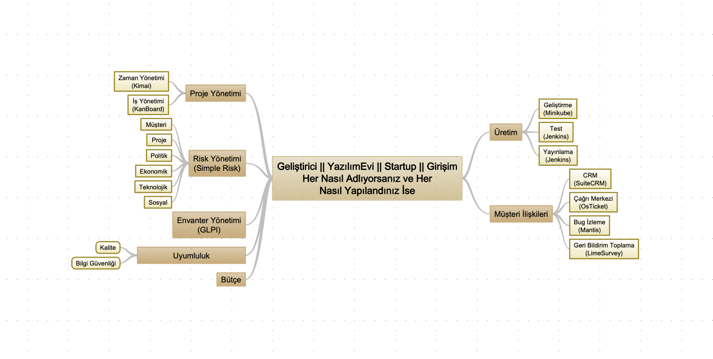

# Yönetim

Bu bölümde, bir ürün geliştiren kişi, ekip veya şirket her ne ise bir ürün geliştirirken gereksinim duyacağı araç gereçleri biraz tanıtmak istiyorum. Çoğu zaman ekipler ya kendileri yazmaya ya da fiyatından dolayı kullanmamaya meyilliler. Bu aşamada hızlı ve iyi çözümler olabilir. Öncelikle (çok revize olacaktır) temel çerçeveyi vereyim;

Takip eden bölümlerde bu çerçevede verilmiş faaliyetlerle ilgili deneyimlediğim ürünler özelinde değerlendirmelerim olacak. Tabii ki burada bahsedeceğim ürünleri değindikçe Application klasöründe bulunabiliyor olacak ve kolay yoldan deneyimleme fırsatı bulacaksınız.

İlk kavramımız **Risk Yönetimi** olacak ve bu konudaki aracımız da [SimpleRisk](../Applications/Business/SimpleRisk/README.md "SimpleRisk").

