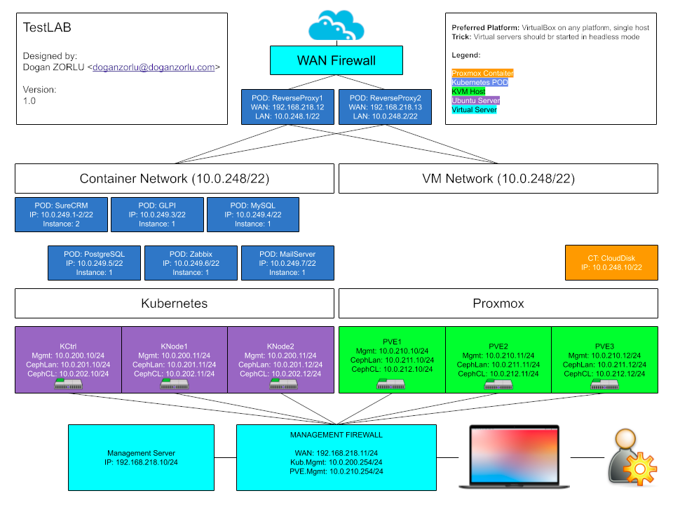
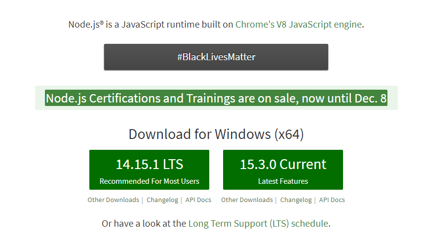

# MacOS İş İstasyonu

Bu bölümde, yazılım geliştirme ekiplerince kullanılabilecek bir "İdeal" MacOS iş istasyonu kurulumu ile ilgili uygulama örneği bulacaksınız. 

# Başlarken

Selamlar,

Öncelikle bu makaleyi neden yazıyorum onu bir açıklayayım. Sürekli bir şekilde hem development hem de devops için platformlar kurup duruyorum. En nihayetinde bir seferini de kayıt altına alayım da belki bu konuda referans arayan birisi olur işine yarar diye bu akışı kayıt altına almak istedim.

Bu makalenin iki sürümü var. Birinci sürümü Windows üzerinde oluşturma, ikincisi ise Linux üzerinde oluşturmayı anlatıyor.

Makalenin sonunda ulaşacağımız sistem aşağıda şematize edilmiş kurguda olacak:



Gerekli olan temel donanım sadece 16GB ram, en az birinci nesil e5 makine ve 250GB disk. Tüm sistemler sürekli açık olmayacak bu nedenle daha fazla donanıma ihtiyaç olmayacaktır. Development aşamasında biraz IDE için, birkaç tane konteyner için ram (db ve mikro servisler için) gerekecek. İşletim sistemi olarak ise 64bit bir Windows 10 ihtiyacımız var.

# Kurulum

## Temel Kurulum

## Geliştirici Araçları

Bu aşamada geliştiriciler ve devops adminleri için rahat bir ortam oluşturacağız. 

### VSCode

İlk olarak [BURAYA TIKLAYARAK](https://code.visualstudio.com "VSCode Sitesi") VSCode sitesinden VSCode uyglamasını indirip kuralım. 

Benim geliştirme yaparken sürekli kullandığım bu editörden öte uygulama ile sistem içinde düzenleyeceğimiz tüm metin dosyalarını çok kolaylıkla düzenleyebileceğiz.

### brew

Homebrew sıkça lazım olacak. Kurulum için;

```console
dogan@MBP ~ % /bin/bash -c "$(curl -fsSL https://raw.githubusercontent.com/Homebrew/install/HEAD/install.sh)"
```
işinizi görecektir.

### iTerm2

Ardından daha etkin bir terminal kullanımı için;

[BURAYA TIKLAYARAK](https://iterm2.com/ "iTerm2 Sitesi") 

ilgili uygulamayı kurup çalıştıralım. Uygulamanın ayarlarında profile içinde session bölümünde git vb. entegrasyonları ayarlayacağınız bir bölüm var. Buradan ben git i aktifleştirdim.

## Python

Yerleşik olarak python2 ile gelen MacOS içinde python3 kurmanın türlü türlü yolları var. Fakat ben en basit seçeneği kullandım;

```console
python3
```

Bu komutla birlikte MacOS yerleşik geliştirme platformu kurucusu sizin için python ve pip için v3 kurulumlarını yapacaktır. Bu söylediğim Big Sur için geçerli. Daha önceki sürümlerde python sitesinden kurulumu indirip kurmak gerekecektir. Ardından;

```console
pip3 install poetry
```

ile poetry yi de kurduk mu python development hazır.

Sırada NodeJS kurulumu var. https://nodejs.org adresinden ulaşıp kurulumu yapıyoruz.



Ben genelde LTS sürümleri kullanıyorum. Gecelik sürümleri denediğim bir başka makinem daha var. Denemelerimi orada yapıyorum. Bu arada node için doğal modülleri derlemek gerekirse gerekli araçları yüklemesini kurulum sırasında seçebiliriz. Bunu seçerseniz diğer araç gereçlerle birlikte chocolatey (Hatırladınız sanırım) de kurulacak ve sistemde gerekli tüm yamalar yapılacak, kendisine gerekli python kendi extension ları içine kurulacak ve gerekli yetkilendirmeler powershell için otomatik olarak oluşturulacaktır. Komple bir paket yöneticisi olduğu için oldukça fazla değişiklik yapacaktır. Bu makinenin kurulumu bitince günlük tam image backup alacağız ve süreklilik konusunu çözeceğiz. Zira makine kurulumuna bağlı zaman kaybetmek istemiyorum.

Yolculuğumuzun üçte birlik kısmına yaklaştık diyebiliriz. Bu aşamadan sonra zaten elle tutulmaz olan sistemimizde daha da sanal ortamlar oluşturacağız. Herşey mış gibi olacak bu bölümde.

## Virtualization Platform

Geliştirici makinemizde sanallaştırma platformu olarak Oracle VirtualBox kullanacağız. Oldukça pratik ve HeadLess çalışabilmesi nedeni ile de oldukça kaynak dostu bir sistem olacak. Özellikle network katmanını çok seveceksiniz.

https://www.virtualbox.com adresinden indirip normal bir kurulum yapıyoruz.

# Minikube ?

Geliştirme için gerekli olacak birkaç tane servisin yapılandırma dosyalarını ekledim. Bu dosyalardaki credential bilgileri admin123 parolası kullanıyor. Eğer production da bu yapılandırmaları kullanacak olursanız değiştirmeniz gerekir. Çalışırken yeni başlayanlar için belki daha kolay olur diye minikube kurup, geliştirme için bunu da opsiyon olarak ekleyeyim istedim. Öncelikle kurulum çok kolay. 

[MINIKUBE İndirme Linki](https://storage.googleapis.com/minikube/releases/latest/minikube-darwin-amd64 "MINIKUBE İndirme Linki")

Bu dosyayı /usr/local/bin dizine minikube olarak koyup ;
```console
sudo chmod +x /usr/local/bin/minikube
```  
ile çalıştırılabilir dosya olarak işaretliyoruz.

```console
curl -LO "https://dl.k8s.io/release/$(curl -L -s https://dl.k8s.io/release/stable.txt)/bin/darwin/amd64/kubectl"
sudo mv kubectl /usr/local/bin
chmod +x /usr/local/bin/kubectl
```
ile kubectl yi de hazır hale getiriryoruz.

Artık minikube kurmaya hazırız.

```cosole
C:\bin> minikube start --driver=virtualbox --cpus 2 --memory 4000
```

komutu ile makinemizde kurulu VirtualBox ı kullanarak kendi image dosyasını indirip kendi VM ini oluşturacaktır. Driver parametresini vermezseniz kendisi anlayacaktır. Bu kadar. Bellek miktarı ile cpu sayısını sonradan değiştiremezsiniz. Mutlaka mevcut cluster'ı kaldırıp yeniden kurmanız gerekir.

Bu projenin kök dizininde Infrastructure diye bir klasör göreceksiniz. Haydi oradaki postgis servisini deploy edelim;

```console
kubectl apply -f 00-namespace
kubectl apply -f 02-postgis
```

evet bu kadar. Bu dosyaların ne olduğunu daha sonra açıklayacağım. Servisin durumu nedir bakalım;

```console
dogan@DoganMBP postgres % kubectl describe deployment -n postgres
Name:                   postgis
Namespace:              postgres
CreationTimestamp:      Mon, 01 Feb 2021 13:59:02 +0300
Labels:                 <none>
Annotations:            deployment.kubernetes.io/revision: 1
Selector:               app=postgis
Replicas:               1 desired | 1 updated | 1 total | 1 available | 0 unavailable
StrategyType:           RollingUpdate
MinReadySeconds:        0
RollingUpdateStrategy:  25% max unavailable, 25% max surge
Pod Template:
  Labels:  app=postgis
  Containers:
   postgis:
    Image:      postgis/postgis
    Port:       5432/TCP
    Host Port:  0/TCP
    Environment Variables from:
      postgis-config  ConfigMap  Optional: false
    Environment:      <none>
    Mounts:
      /var/lib/postgresql/data from postgisdb (rw)
  Volumes:
   postgisdb:
    Type:       PersistentVolumeClaim (a reference to a PersistentVolumeClaim in the same namespace)
    ClaimName:  postgis-pv-claim
    ReadOnly:   false
Conditions:
  Type           Status  Reason
  ----           ------  ------
  Available      True    MinimumReplicasAvailable
  Progressing    True    NewReplicaSetAvailable
OldReplicaSets:  <none>
NewReplicaSet:   postgis-647c7475bf (1/1 replicas created)
Events:
  Type    Reason             Age    From                   Message
  ----    ------             ----   ----                   -------
  Normal  ScalingReplicaSet  9m28s  deployment-controller  Scaled up replica set postgis-647c7475bf to 1
dogan@MBP postgres %
```
Herşey yolunda görünüyor. Bu şekilde minikube kurulumu yapmış olduk. Sadece development yapacak başka da birşeyle uğraşmayacaklar için sadece bu platform yeterli olacaktır.

Bugünlük de bu kadar. 