# Windows İş İstasyonu

Bu bölümde, yazılım geliştirme ekiplerince kullanılabilecek bir "İdeal" windows iş istasyonu kurulumu ile ilgili uygulama örneği bulacaksınız. 

# Başlarken

Selamlar,

Öncelikle bu makaleyi neden yazıyorum onu bir açıklayayım. Sürekli bir şekilde hem development hem de devops için platformlar kurup duruyorum. En nihayetinde bir seferini de kayıt altına alayım da belki bu konuda referans arayan birisi olur işine yarar diye bu akışı kayıt altına almak istedim.

Bu makalenin iki sürümü var. Birinci sürümü Windows üzerinde oluşturma, ikincisi ise Linux üzerinde oluşturmayı anlatıyor.

Makalenin sonunda ulaşacağımız sistem aşağıda şematize edilmiş kurguda olacak:


Gerekli olan temel donanım sadece 16GB ram, en az birinci nesil e5 makine ve 250GB disk. Tüm sistemler sürekli açık olmayacak bu nedenle daha fazla donanıma ihtiyaç olmayacaktır. Development aşamasında biraz IDE için, birkaç tane konteyner için ram (db ve mikro servisler için) gerekecek.

# Kurulum

## Temel Kurulum

Yeni bir windows kurulumu yapıp hesabımıza giriş yaptıktan sonra ilk yapacağımız iş Linux alt sistemini aktive etmek. Bunun için aşağıdaki görsellerde verdiğim adımları izlemeniz yeterli olacaktır. Temelde bir windows özelliğini aktive edip ardından Microsoft Store dan ubuntu 20.04 LTS (Dökümanı yazdığım sırada en günceli bu olduğu için) kurulmasından ibaret bir işlem.

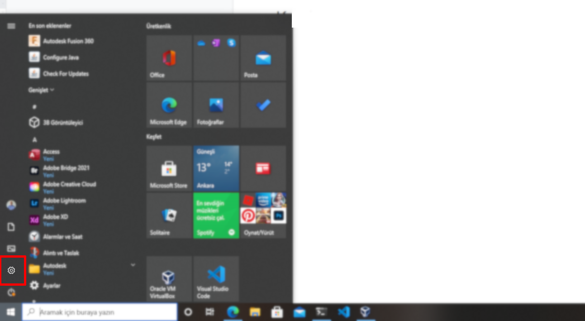
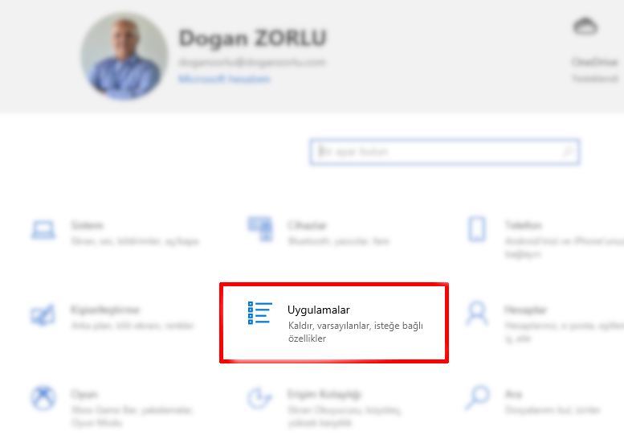
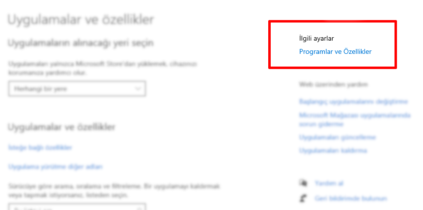
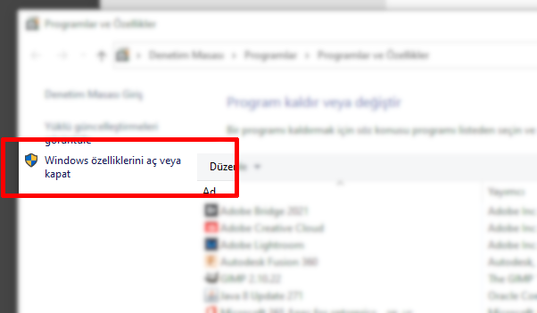
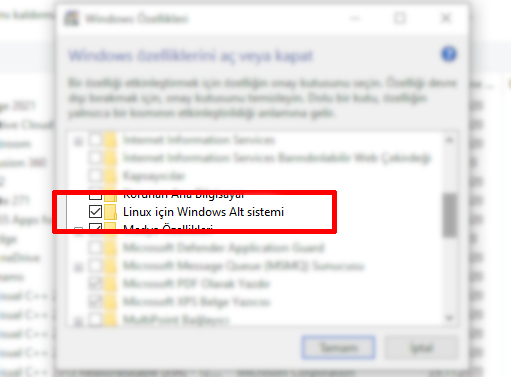
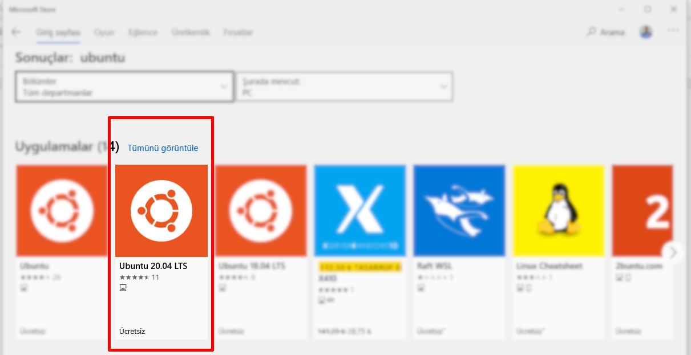

Bu aşamalardan birisinde restart isterse sistem restart ediniz. Artık ikinci aşamaya geçebiliriz. Bu aşamada geliştiriciler ve devops adminleri için rahat bir ortam oluşturacağız. İlk olarak [BURAYA TIKLAYARAK](https://code.visualstudio.com "VSCode Sitesi") VSCode sitesinden VSCode uyglamasını indirip kuralım.

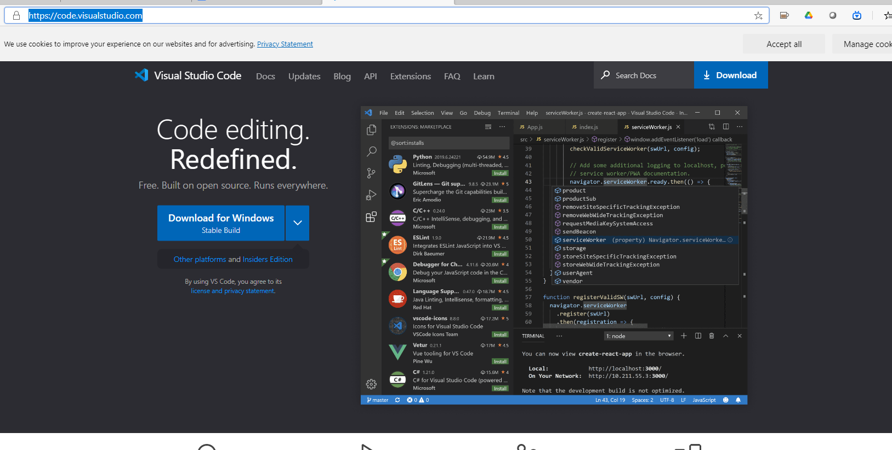

Benim geliştirme yaparken sürekli kullandığım bu editörden öte uygulama ile sistem içinde düzenleyeceğimiz tüm metin dosyalarını çok kolaylıkla düzenleyebileceğiz.

Ardından Microsoft Store Windows Terminal uygulamasını kuralım.

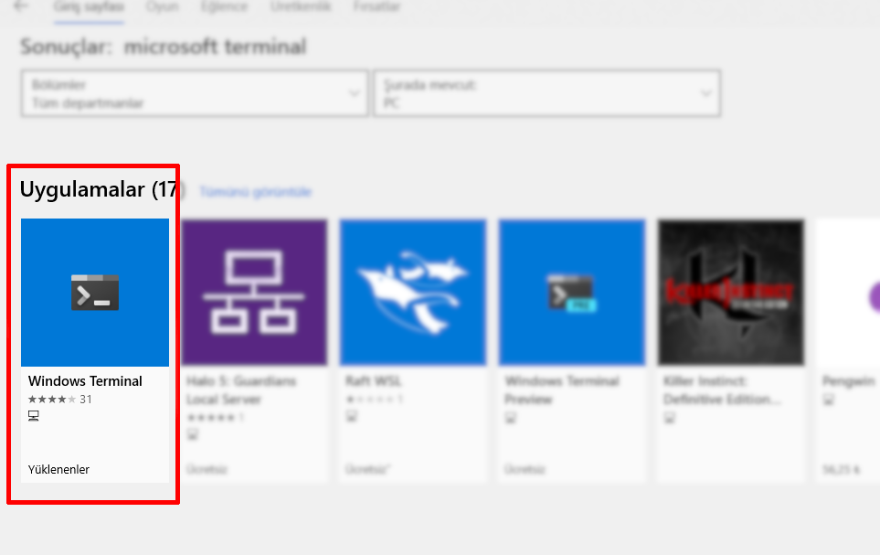

Bu ortam, özellikle CLI çalışacak bu ilgi grubu için oldukça kolaylık sağlayacaktır. Hadi şimdi biraz özelleştirelim terminalimizi.

Öncelikle Windows Terminal uygulamamızı açıp ayarlar JSON dosyasını açıyoruz. Bunun için sekmelerin en sağında yer alan aşağı yönlü oku tıklatıyoruz. Açılan menüden settings bölümüne giriyoruz.

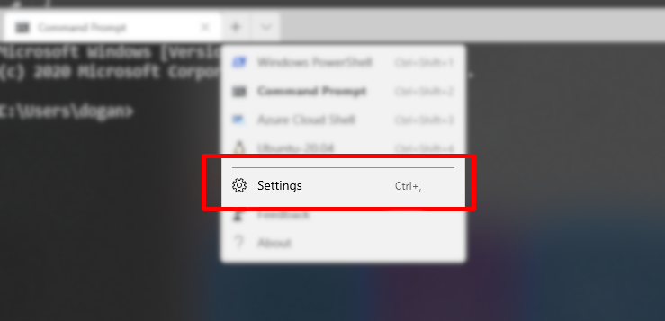

JSON dosyaları, kurulumda itiraz etmedi ve desteklediğin tüm dosyaları kendine kaydet dediyseniz VSCode ile açılacaktır.

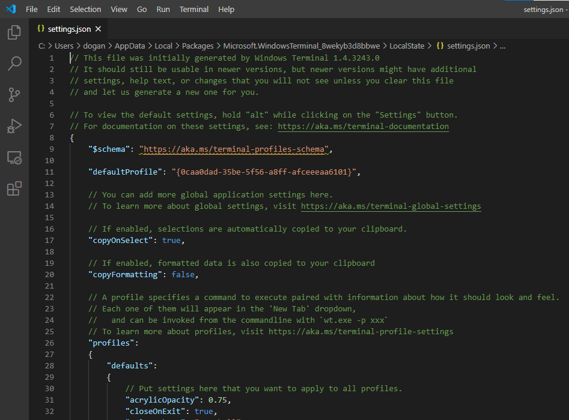

Bu standart bir JSON dosyası. Bu arada bin yıl öncede takılıp kalan yeminli MS karşıtları için bir ufak hatırlatma: MS epeydir CLI üzerinden metin dosyaları ile yapılandırmaları saklamaya başladı. Binary yapılandırma dosyalarının çıkardığı sorunlara karşı geliştirdikleri bir iyileştirme bu. Endüstri standardı yapılandırma dosyalarını da bir metin editörü ile rahatlıkla düzenleyebiliyoruz. Neyse. Bu yapılandırma dosyasının yapısı size tanıdık gelecek. Üst tarafta bir default profil var. Bunu kendinize göre düzenlersiniz. Ben default olarak CMD.EXE yi seçtim. Hadi buraya ubuntu altsistemimizi ekleyelim.

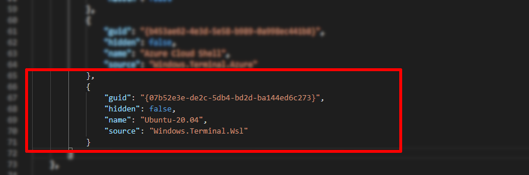

List anahtarının altına bir anahtar ekleyip ardından içini yukarıdaki gibi doldurun. guid sizde değişecektir. Bu bilgiyi almak için;

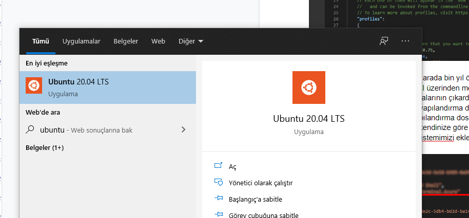

başlangıç menüsünde ubuntu yazıp başlatıcıyı bulup çalıştırın. Ardından;

```console
# uuidgen
```
komutunu çalıştırıp alt sistemin uuid sini öğrenebilirsiniz.

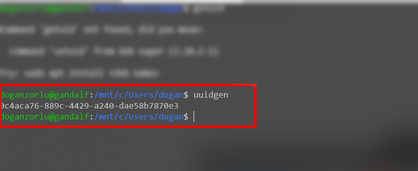

Yapılandırma dosyamızı kaydedip kapatıyoruz ve artık ortamımız epeyce hazır. VSCode u ubuntu alt sisteminden çalıştırmayacağımız için (bazen bu metodu da kullanıyorum, o durumda yapılandırılacak sistem windows yerine ubuntu alt sistemi oluyor) git kurmamız için bulunmaz zaman şu an. Ben git kullanıyorum siz başka birşey kullanıyorsanız o sistemin istemcisini kurabilirsiniz. Adresimiz https://git-svn.com adresinden uygulamayı indirip kuruyoruz.

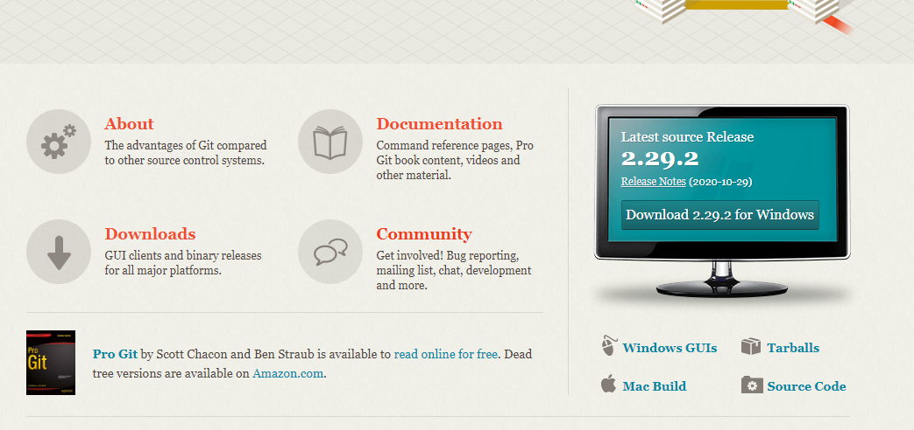

Yine terminal yapılandırma dosyasında birkaç küçük kozmetik düzenleme yaptım. Belki hoşunuza gider:

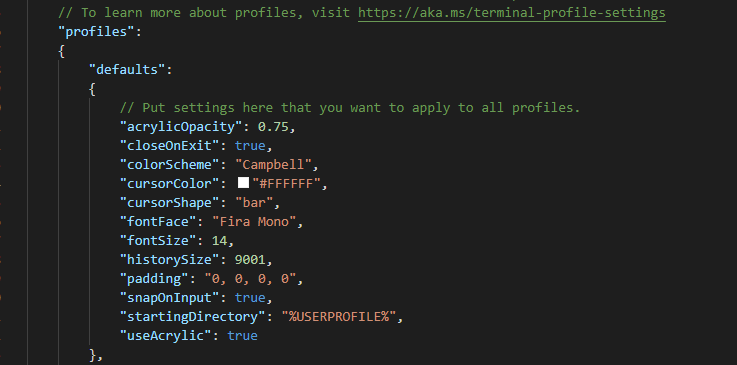

defaults anahtarı List içindeki tüm girdilerde ortak olarak çalışır. Herhangi bir konsolu farklı çalıştırmak istiyorsanız ilgili girdide değişiklik yapmanız yeterki olacaktır.

Ben tüm anlık işlerimi VSCode içindeki kod yönetimi kısmından, depo operasyonlarını ise CLI dan yaptığım için bir GUI kurmuyorum. Bu hem cross platform bir rahatlık sağlıyor hem de gerek duymuyorum açıkçası.

Buraya kadar kurduğumuz uygulamalarda her ne soruyorsa evet diyerek ilerleyip standart kurulum yaptık. Sadece VSCode için desteklediği dosya tipleri için geçerki düzenleyici olarak kendisini set etmesini istedik.

İlk aşama bu şekilde tamamlandı. Şu anda geliştirme için gerekli dilin yüklenmesi yeterki olacak. Ben tüm geliştirmelerimi python ve node ile yaptığımdan sadece bu ikisini kuracağım siz kendinize göre özelleştirebilirsiniz.

Adresimiz bu sefer https://www.python.org. Bu adresten python kurulumumuzu yapacağız.

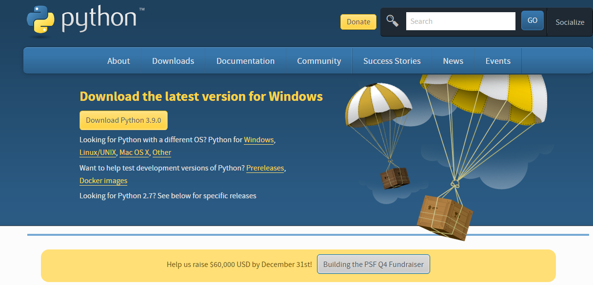

Ben kurulumlarda root dizinde python dizinini tercih ediyorum. Hem ulaşması kolay hem de zateb çok uzun olan PATH daha da uzayıp gitmiyor. Eğer sizde path limite gelmişse bunu disable etmeniz gerekebilir.

İlk olarak her eve lazım JDK kuralım. Ben https://www.oracle.com/java/technologies/javase-jdk15-downloads.html adresinden yükledim. 

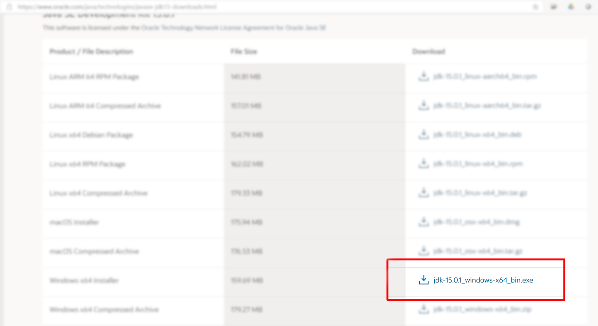

Yüklemelerde sisteminizin mimarisine uygun olanları kurmanız yararlı olacaktır. Bende 64 bit bir windows kurulu (ki 4GB üstünü 32bit ile kullanamazsınız) o nedenle tüm uygulamaların da 64 bit olan sürümlerini kuruyorum.

Sırada NodeJS kurulumu var. https://nodejs.org adresinden ulaşıp kurulumu yapıyoruz.


Ben genelde LTS sürümleri kullanıyorum. Gecelik sürümleri denediğim bir başka makinem daha var. Denemelerimi orada yapıyorum. Bu makinenin kurulumu bitince günlük tam image backup alacağız ve süreklilik konusunu çözeceğiz. Zira makine kurulumuna bağlı zaman kaybetmek istemiyorum.

Yolculuğumuzun üçte birlik kısmına yaklaştık diyebiliriz. Bu aşamadan sonra zaten elle tutulmaz olan sistemimizde daha da sanal ortamlar oluşturacağız. Herşey mış gibi olacak bu bölümde.

## Virtualization Platform

Geliştirici makinemizde sanallaştırma platformu olarak Oracle VirtualBox kullanacağız. Oldukça pratik ve HeadLess çalışabilmesi nedeni ile de oldukça kaynak dostu bir sistem olacak. Özellikle network katmanını çok seveceksiniz.

https://www.virtualbox.com adresinden indirip normal bir kurulum yapıyoruz.

## Container Platform

İki adet kuracağız. Birisi geliştirme sırasında kullanacağımız. Bu platformu microk8s üzerinde koşturacağız. Normalde yapılan tam kurulumun geliştirme platformu için küçültülmüş bir sürümü. Deployment senaryoları için VM makineler içine de ikinci bir sistem olarak tam bir kurulum da yapacağız. mikrok8s kurulumu için (ve diğer VM ler için de gerekecek olan ubuntu 20.04 LTS iso dosyasını indirelim. httpd://releases.ubuntu.com/20.04 gideceğimiz adres. Yine hatırlatmakta fayda var, anlık son sürüm bu olduğu için bu sürümü kuruyorum. Siz bu dökümana ulaştığınızda eminin başka sürümler olacaktır.

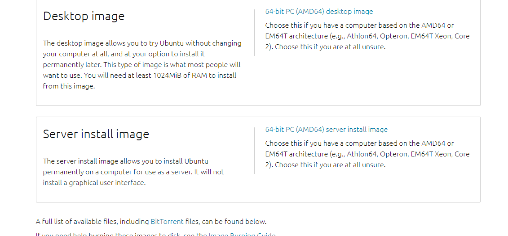

Server install image bölümündeki dosyayı kullanacağız. Şimdi VirtualBox içerisinde makinemizi kuralım. 

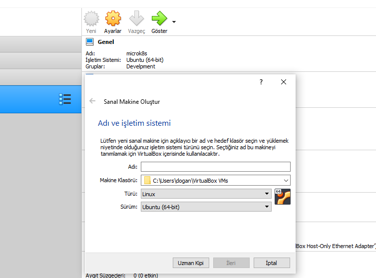

4GB ram ve 100 GB disk alanı yeterli olur. (100 GB ı daha sonraki aylarda yer gerekirse LVM i genişletmek için uğraşmayalım diye bu şekilde yapıyoruz. Ben bunu kolay yapabildiğimden 20GB yaptım.) Ağ ayarlarında ise bir NAT (güncelleme vs için) bir adet de Host Only interface (sanal makineye host üzerinden erişmek için işe yarayacak) ayarlayacağız.

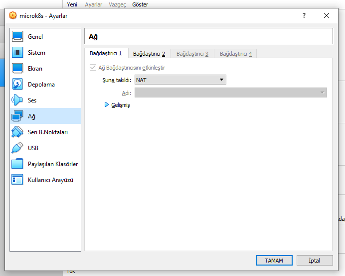
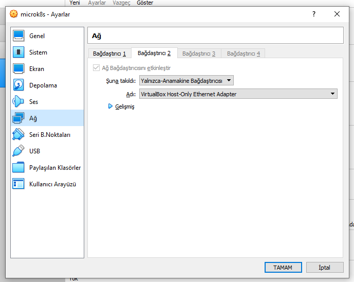

Aslında bunları video ile daha rahat anlatabilirim fakat evde bu kaydı yapabilecek yer yok maalesef.

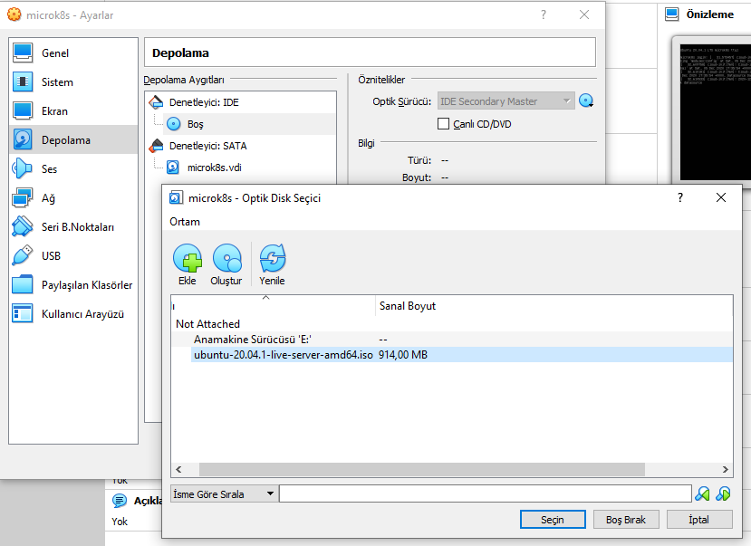

Yukarıda görüldüğü üzere makinemizin sanal CD sürücüsüne iso dosyamızı bağlayıp kurulumu başlatıyoruz. Her sorduğuna evet diyerek sonlandırıyoruz. Kurulum sırasında normal bir kullanıcı adı soracaktır. Ben kendi adımı verdim bu örnekte, siz de kendi adınızı kullanabilirsiniz.

### Kurulum sonrası ağ yapılandırması

Bu aşamada makine konsoluna VirtualBox dan bağlanıp makinenin Host-Only interface ine adres vereceğiz ve ssh sunucuyu aktive edip firewall dan giriş için izin vereceğiz.

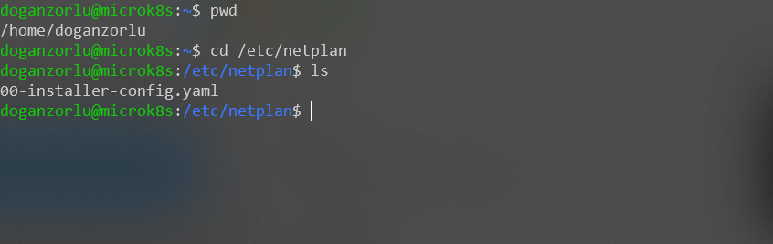

Bu ayarları yapmak için /etc/netplan dizinine gidiyoruz. Ubuntu bu sürümde ağ yapılandırması için Netplan, firewall olarak da ufw kullanıyor. Buradaki .yaml dosyası makinenin ağ yapılandırmasını barındırıyor.

```console
$ ip link 
```

komutu ile interface isimlerini alalım önce.

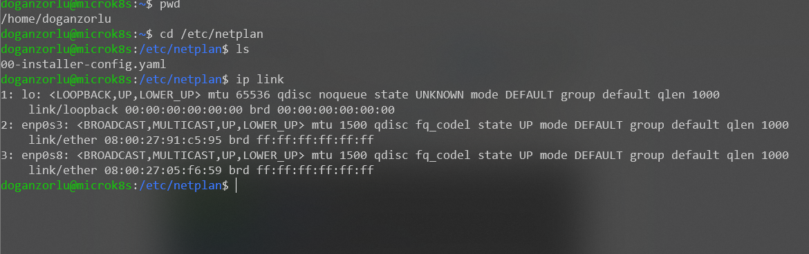

Burada ikinci interface enp0s8 görünüyor. Bunu mac adresini VirtualBox içindeki ağ ayar bölümündeki ile karşılaştırmak iyi bir alışkanlık olacaktır.

sudo, bu sistemlerde sıklıkla kullanacağımız bir komut. Kullanılacak komutu root yetkileri ile çalıştıracaktır.

```console
$ sudo vi 00-installer-config.yaml
```
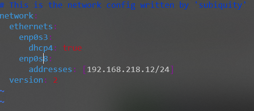

Bu bölüme eğer yoksa enp0s8 girdisini oluşturup altında yukarıdaki adresleri veriyoruz. 192.168.218.0/24 adresi, virtualbox içinde öntanımlı olarak ilk Host Only interface için belirlenmiş adres. Host makine 192.168.218.1/24 adresini alıyor kendisine. Özelleştirilmiş bir network de kullanılabilir ama bazen sorun çıkarıyor. Sizdeki yapılandırmada ön tanımlı adresi VirtualBox ana makine ağ yöneticisinden görebilirsiniz.


SSH Server aktivasyonu ve portu firewall da açmak için ise

```console
$ sudo apt-get update
$ sudo apt-get install openssh-server
$ sudo ufw allow ssh
```

kullanabiliriz. Şimdi artık Windows Terminal uygulamasında ubuntu konsolunu açabiliriz. Microk8s ubuntu makinemize bağlanmaya hazırız. 

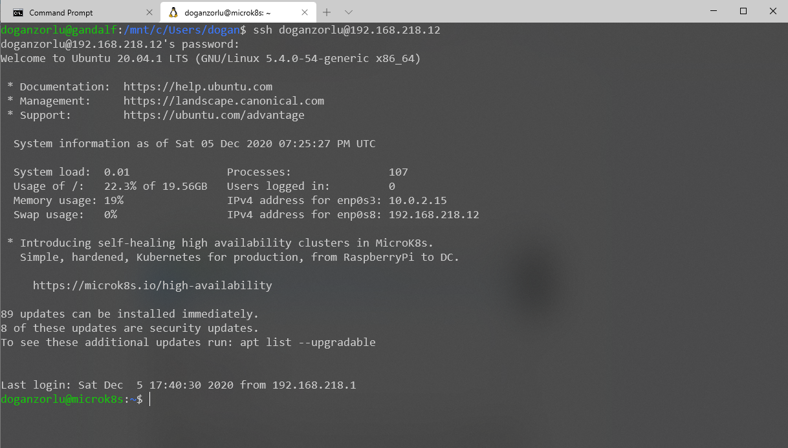

Sihirli komutumuz (ve sanırım en fazla kullanacağımız komut) ssh.

```console
$ ssh <kullanici>@192.168.218.12
```

Burada <kullanici> alanina ubuntu kurulumunda verdiğimiz kullanici kodunu vereceğiz. Artık bu aşamayı da geçtik sayılır.

Elimizdekiler:

* Temel araçları yüklenmiş windows
* Sanallaştırma platformu
* Microk8s kurulumu için yapılandırılmış bir sanal Ubuntu makine.

### Microk8s ile Kubernates Kurulumu

Ubuntu snap paket yöneticisi ile geliyor. Paketleri standart apt depolarından ya da snap deposundan yükleyebiliyorsunuz.

```console
$ sudo snap install microk8s --classic
```

komutu ile tek bir işlemde neredeyse her şey hazır hale geliyor. Hem pod larımızın arasındaki iletişim için hem de pod ların internete erişebilmesi için;

```console
$ sudo ufw allow in on cni0 && sudo ufw allow out on cni0
$ sudo ufw default allow routed
```

Birkaç lazım olacak addon da etkinleştirelim;

```console
$ microk8s enable dns dashboard storage
```

Eğer root yerine kendi kullanıcınız ile sistemi kullanacaksanız (önerimdir) 

```console
$ sudo usermod -a -G microk8s <kullaniciadi>
$ sudo chown -f -R <kullaniciadi> ~/.kube
```

exit ile oturumu kapatıp, tekrar bağlanmak gerekli olacaktır. Bu aşamada dashboard erişimi için default-token gerekecek. Hemen onu da alalım;

```console
$ token=$(microk8s kubectl -n kube-system get secret | grep default-token | cut -d " " -f1)
$ microk8s kubectl -n kube-system describe secret $token
```

Bu tokeni bir kenara not etmekte yarar var. Bir sertifika olduğu için uzunca olacak şaşırmayın. Bu ne zaman dashboard a erişmek gerekse lazım olacak.

Şu anda işler yolunda görünüyor. Bakalım sistem bileşenleri gerçekten çalışır durumda mı;

```console
$ microk8s kubectl get all -A
```
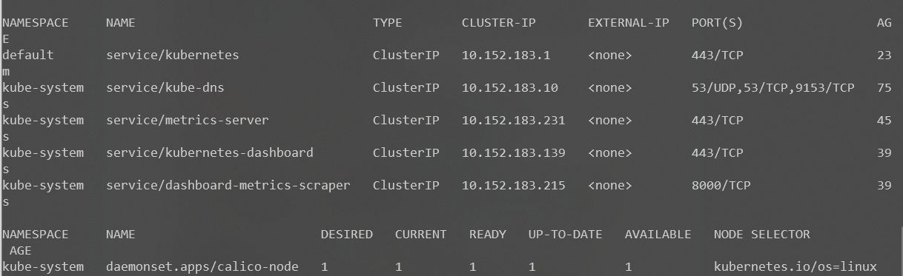

Buradan aynı zamanda servislerin aldıkları cluster IP numaraları da görünüyor. Cluster network yukarıdaki örnekte 10.152.0.0/16 olduğundan windows makinemize bir route yazıp bu network için geçidi belirtmemiz yerinde olacaktır. Bu işlem için yönetici olarak çalıştırılmış bir cmd.exe konsolunda;

```console
route -p add 10.152.0.0 mask 255.255.0.0 192.168.218.12
```
komutunu kullanabiliriz.

Hatırlarsanız microk8s vm makinesinin erişim (host only adapter üzerinden) ip si 192.168.218.12 olarak vermiştik. Bakalım sistemi çalışıyor mu deneyelim. Hemen Windows Terminalde bir ubuntu oturumu açıp ssh ile bağlanalım;

ardından home dizinde ben infrastructure adını verdim, bir dizin oluşturalım. yaml dosyalarımızı bu dizine koyacağız.

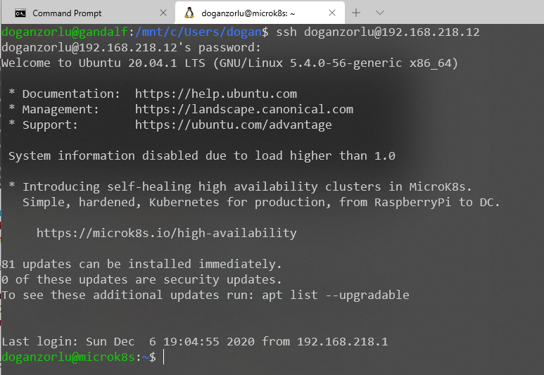

Burada;

```console
$ mkdir Infrastructure
$ cd Infrastructure
$ vi helloworld.yaml
```

komutları ile bir editör açıp helloworld uygulaması için bir yaml dosyası oluşturuyoruz. 

```yaml
apiVersion: apps/v1
kind: Deployment
metadata:
  name: hello-world
spec:
  selector:
    matchLabels:
      run: load-balancer-example
  replicas: 1
  template:
    metadata:
      labels:
        run: load-balancer-example
    spec:
      containers:
        - name: hello-world
          image: gcr.io/google-samples/node-hello:1.0
          ports:
            - containerPort: 8080
              protocol: TCP
```
ESC-:
w
ESC-:
q

ile çıkıyoruz (ESC-: esc ye bastıktan sonra iki nokta üstüsteye bas demek, sizi vi komut satırına götürür). Tavsiyem vi öğrenin çok basit bir editördür bulunmadığı yer yoktur. yaml için girintilere dikkat ediniz.

Artık ilk distribution için hazırız.

```console
$ microk8s kubectl apply -f helloworld.yaml
```

Deployment tek örnek olarak hazırlandı ve geleneksel helloworld için hazırlanmış bir konteyner dağıtılacak. LoadBalancer tipinde bir servis ile de dışarı açacağız. 8080 portunu dinleyecek. Bakalım deploy edilmiş mi ?;

```console
$ microk8s kubectl get deployment hello-world

NAME          READY   UP-TO-DATE   AVAILABLE   AGE
hello-world   1/1     1            1           6h44m
```

1/1 ready iyi haber. Detaylı bir bakalım;

```console
$  microk8s kubectl describe deployment hello-world

Name:                   hello-world
Namespace:              default
CreationTimestamp:      Sun, 06 Dec 2020 12:44:36 +0000
Labels:                 <none>
Annotations:            deployment.kubernetes.io/revision: 1
Selector:               run=load-balancer-example
Replicas:               1 desired | 1 updated | 1 total | 1 available | 0 unavailable
StrategyType:           RollingUpdate
MinReadySeconds:        0
RollingUpdateStrategy:  25% max unavailable, 25% max surge
Pod Template:
  Labels:  run=load-balancer-example
  Containers:
   hello-world:
    Image:        gcr.io/google-samples/node-hello:1.0
    Port:         8080/TCP
    Host Port:    0/TCP
    Environment:  <none>
    Mounts:       <none>
  Volumes:        <none>
Conditions:
  Type           Status  Reason
  ----           ------  ------
  Progressing    True    NewReplicaSetAvailable
  Available      True    MinimumReplicasAvailable
OldReplicaSets:  <none>
NewReplicaSet:   hello-world-59966754c9 (1/1 replicas created)
Events:
  Type    Reason             Age    From                   Message
  ----    ------             ----   ----                   -------
  Normal  ScalingReplicaSet  6h45m  deployment-controller  Scaled up replica set hello-world-59966754c9 to 1
```

Şahane, işler yolunda gidiyor. Deployment biraz sürebilir. Sabırsız olmamak lazım. Şimdi de bu deployment ı bir LoadBalancer servisi ile expose edelim de host makineden erişilebilir hale gelsin.

```console
$ kubectl expose deployment hello-world --type=LoadBalancer --name=my-service
```

helloworld deployment ı için my-service adında bir LoadBalancer oluşturdum. Bakalım external ip ne vermiş…

```console
$ microk8s kubectl describe service my-service

Name:                     my-service
Namespace:                default
Labels:                   <none>
Annotations:              <none>
Selector:                 run=load-balancer-example
Type:                     LoadBalancer
IP:                       10.152.183.185
Port:                     <unset>  8080/TCP
TargetPort:               8080/TCP
NodePort:                 <unset>  30177/TCP
Endpoints:                10.1.128.211:8080
Session Affinity:         None
External Traffic Policy:  Cluster
Events:                   <none>
```
External IP miz 10.152.183.185. Hatırlarsanız bu ip nin de içinde olduğu bloğu host üzerinden route etmiştik. Şimdi edge browser ımızı açıp bir bakalım erişilebiliyor mu herşey yolunda mı…

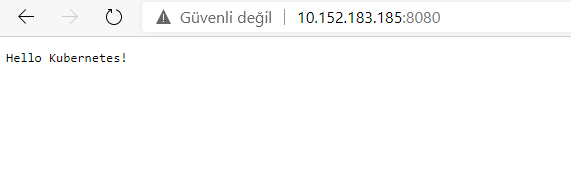

olmuş. 

# Biraz Mola ....
Bu haftalık bu kadar. İki günlük hafta sonu tatili için geldiğimiz aşama fena değil. Sonraki bölümlerde makinenin periyodik image yedeklerini alma işini çözeceğiz. Kuberbetes için persistent storage, hyperconverge tarafında ise KVM  + CEPH üzerinde normal VM ve LXC container larının yapılandırılması var.

Şimdilik kalın sağlıcakla.


